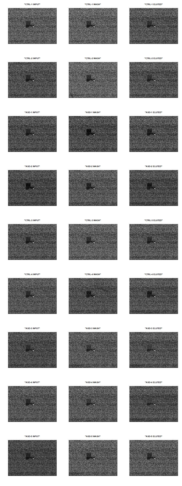

```{r setup, include=FALSE}
# knitr options

# Do not display code in output document
knitr::opts_chunk$set(echo = FALSE,
                      message = FALSE,
                      warning = FALSE,
                      fig.align = "center")

# This is a try:
knitr::opts_knit$set(stop_on_error = 2L)
# See ?evaluate::evaluate
# What I am trying to do is to make knitr stop
# when an error is found instead of running the
# complete script.
```

# Sumario
Se cree que un gen, o una familia de genes, cuya función afecta a la poliadenilación del ARNm podría estar implicado en el riesgo de sufrir el trastorno de espectro autista (ASD). El examen mediante microarray de genes cuyo ARN tiene patrones de poliadenilación diferentes entre muestras de cerebro humano control, y muestras de personas con ASD, apunta a que genes implicados en el riesgo de ASD presentan estos patrones de poliadenilación diferencial con más frecuencia de lo que sería esperado por azar.


```{r estructura de directorios}
# Directory for raw data
if (!(dir.exists("data"))){
dir.create("data")
}
# Directory for results
if (!(dir.exists("results"))){
  dir.create("results")
}
# Directory for processed data
if (!(dir.exists("intermediateResults"))){
  dir.create("intermediateResults")
}
# Directory for images
if (!(dir.exists("images"))){
  dir.create("images")
}
```

# Objetivos

El objetivo, dentro del trabajo original [@parras2018autism], es estudiar el acortamiento (deadenilación) de la cola poli-A, provocada por las proteínas CPEB1-4 (_cytoplasmic polyadenylation element binding proteins_) en ARNm de genes asociados al riesgo de desarrollar trastorno del espectro autista ("autism spectrum disorder", ASD).

Mi objetivo en este análisis es, a partir de los datos de expresión detectados por las microarrays, extraer un listado de genes cuyos ARNm contengan una cola poli-A más larga, o más corta, al comparar muestras de sujetos control con muestras de sujetos con ASD. Una vez obtenido el listado, el objetivo final es averiguar, primero, qué términos de la ontología génica están significativamente enriquecidos en esa lista de genes. Y segundo, si nuestra lista de genes contiene más genes asociados al riesgo de ASD de lo que sería esperable por azar.

# Materiales y métodos

## Muestras y datos de origen
El material biológico de partida fueron muestras post-mórtem de córtex prefrontal de pacientes con trastorno del espectro autista (n = 5) y de controles (n = 4), todos ellos varones de 5-23 años de edad. A partir de las muestras de tejido se extrajo el ARN total. De cada muestra de ARN total se guardó una alíquota ("Input"), y el resto se separó por cromatografía en un fracción enriquecida en ARNm con colas poli-A largas ("Wash") y otra enriquecida en ARNm con colas poli-A cortas ("Eluted"). Las muestras de ARN fueron traducidas a ADNc, y este amplificado.

Las muestras de ADNc fueron hibridadas en arrays GeneChip Human PrimeView (Affymetrix, 901838); estos fueron leídos en un GeneChip Scanner GCS3000 (Affymetrix), y mediante Command Console (Affymetrix) los datos se almacenaron en archivos CEL. Estos archivos CEL base del presente análisis, y los datos necesarios para realizar la anotación de los genes destacados, fueron descargados desde la web de Gene Expression Omnibus (GEO) [@clough2016gene].

## Diseño experimental

El conjunto de 27 ficheros CEL (cada uno procedente de una microarray) se puede clasificar según la condición del sujeto de origen ("Control" o "ASD"), y según el enriquecimiento en diferentes longitudes de colas poli-A en los ARNm ("Input", "Wash", o "Eluted").

Por combinación de ambas variables podemos dividir las muestras en seis grupos experimentales:  

|Control-Input|ASD-Input|  
|Control-Wash|ASD-Wash|  
|Control-Eluted|ASD-Eluted|

Las muestras "Input" contienen el ARN total. Si comparamos las muestras Control-Input con las muestras ASD-Input, comprobaremos si podemos detectar expresión diferencial entre las condiciones Control y ASD.

Las muestras "Wash" están enriquecidas en ARN de cola poli-A corta, y las muestras "Eluted" en ARN de cola poli-A larga. Podemos hacer las siguientes comparaciones:  

- Control-Wash vs Control-Eluted: Qué genes se transcriben a ARN de diferentes longitudes de cola poli-A en sujetos Control.

- ASD-Wash vs ASD-Eluted: Qué genes se transcriben a ARN de diferentes longitudes de cola poli-A en sujetos Control.

- Comparando los listados de genes de las dos comparaciones anteriores obtendremos un listado de los genes que se comportan de forma diferente en sujetos Control y sujetos ASD con respecto a las colas poli-A de sus ARN.

## Procedimiento seguido en el análisis

Los pasos seguidos para realizar el presente análisis han sido los siguientes: 

1. Obtenión de los datos de expresión en bruto.  
2. Control de calidad de los datos brutos.  
3. Normalización.  
4. Control de calidad de los datos normalizados.  
5. Filtraje no específico.  
6. Identificación de genes diferencialmente expresados.  
7. Anotación de los resultados.  
8. Comparación entre comparaciones.  
9. Análisis del enriquecimiento de rutas.

### Obtención de los datos en bruto

Los datos en bruto usados en el análisis ha sido descargados de Gene Expression Omnibus, un repositorio público de datos de genómica funcional, donde los datos están catalogados bajo el código de acceso [GSE113834](https://www.ncbi.nlm.nih.gov/geo/query/acc.cgi?acc=GSE113834).

Los datos de expresión han sido descargados de dicho repositorio en forma de ficheros CEL.

La relación entre cada fichero y el grupo experimental al que pertenece se ha extraido de la tabla "Samples", accesible en la misma página web que los ficheros CEL.

Los datos de anotación correspondientes al modelo de array usado, están catalogados en el repositorio GEO bajo el código de acceso [GPL15207](https://www.ncbi.nlm.nih.gov/geo/query/acc.cgi?acc=GPL15207). Dichos datos han sido descargados en forma de fichero de texto, y usados para anotar los datos obtenidos de las sondas de las arrays.

```{r prepare data from CEL files, eval=FALSE}
GSE_address <- "https://www.ncbi.nlm.nih.gov/geo/query/acc.cgi?acc=GSE113834"
data_origin <- "https://www.ncbi.nlm.nih.gov/geo/download/?acc=GSE113834&format=file"
gpl_origin <- "https://www.ncbi.nlm.nih.gov/geo/query/acc.cgi?mode=raw&is_datatable=true&acc=GPL15207&id=17536&db=GeoDb_blob169"

# De-compress files
cel_tar <- "data/GSE113834_RAW.tar"
untar(cel_tar, exdir = "data")
file.remove(cel_tar)
zip_files <- dir("data")
sapply(zip_files, function(x){
  system2("gunzip",
          args = c("-d", paste0("data/", x)))
  })
```
```{r generate targets file}
# Generate targets file
# initial_target_file.csv is a copy-paste of the samples/group table
# from the GSE webpage to LibreOffice Calc and saved as a csv file.
targets <- read.csv2("data/initial_target_file.csv", header = FALSE, stringsAsFactors = FALSE)
# Remove trailing spaces in sample names
targets$V1 <- sub("[[:blank:]]", "", targets$V1)
# Add Condition column
targets$Condicion <- as.factor(sub("-[[:print:]]+", "", targets[,2]))
# Add Material column
targets$Material <- as.factor(sub("[[:graph:]]+[[:blank:]]", "", targets[,2]))
# Add Group column. Sep is a dot to make syntactically valid names
targets$Grupo <- as.factor(paste(targets$Condicion, targets$Material, sep="."))
# Rearrange columns
targets <- targets[, c(1, 5, 3, 4, 2)]
# Change column names
colnames(targets)[c(1, 5)] <- c("Archivo", "Abreviado")
# Write final targets file
write.csv2(targets, file = "intermediateResults/targets2.csv", row.names = FALSE)
```


```{r delete results files, eval= FALSE}
# Run this chunk ONLY if you want to re-do
# all the report FROM ZERO.
# Remember that the .RData files are there to
# avoid unnecesarily redoing of long data processing.

file.remove(c("./intermediateResults/dist_matrix.RData",
              "./intermediateResults/gse.RData",
              "./intermediateResults/Pset.RData",
              "./intermediateResults/targets2.csv"))


```


```{r libraries, include=FALSE}
# Install packages
# Load packages
# ...

library(knitr)

```

```{r construct targets file}
# List of CEL files
library('oligo')
celFiles <- list.celfiles("data", full.names=TRUE)
# Generate phenoData
library(Biobase)
my.targets <- read.AnnotatedDataFrame(file.path("intermediateResults", "targets2.csv"), header = TRUE, row.names=1, sep = ";")
```

```{r ExpressionSet con affy}
# This is the only method for generating an ExpressionSet object
# that didn't gave me problems.
# In fact, it is an AffyBatch object, not a pure ExpresionSet.
library(affy)
rawData <- read.affybatch(filenames = celFiles,
                          phenoData = my.targets)
```

Los diferentes archivos con los datos en bruto han sido manipulados utilizando R para realizar los controles de calidad y los análisis propiamente dichos. El código completo usado puede consultarse en el apéndice A.

### Control de calidad de los datos en bruto
Con el control de calidad pretendemos averiguar si los datos de alguna de las muestras presentan defectos o sesgos que desaconsejen usarlos, antes de continuar con el análisis.

En este caso hemos usado examinado los datos de expresión mediante diferenes representaciones gráficas, en busca de anomalías.

```{r re-used variables}
# Labels for each sample
array_labels <- noquote(pData(rawData)$X.Abreviado.)
# Common colour pattern for the graphs
graph_colours <- rainbow(length(array_labels))
```


#### Gráficos de densidad

Los gráficos de densidad nos informan acerca de la forma y posición de las señales sin normalizar.

```{r grafico de densidad, fig.cap= "Gráfico de densidad de las señales sin normalizar. Los colores no son significativos."}
hist(rawData, col = graph_colours,
     main="Densidad de la señal en bruto",
     ylab="Densidad", xlab= "log Intensidad")

legend(x=11.9, y=0.31, legend=array_labels, 
       fill=graph_colours, ncol=2, bty="n", cex=0.5)
```

Este caso vemos que la curva de densidad es similar en todas las muestras, sin mostrar grandes diferencias.

#### Diagrama de cajas

El gráfico de diagrama de cajas nos permite comparar la distribución de la intensidad entre las diferentes muestras.

```{r boxplot, fig.cap="Diagrama de cajas de la intensidad de las muestras sin normalizar. Los colores no son significativos"}
boxplot(rawData,
        names=array_labels,
        cex.axis=0.5, las=2, which="both",
        col = graph_colours,
        main="Distribución de valores de intensidad en bruto")
```

Podemos ver que ninguna de las muestras destaca entre el resto. Hay pequeñas variaciones, pero es una característica esperable cuando comparamos los datos de intensidad en bruto.

#### Dendrograma del clúster jerárquico

El dendrograma nos ayuda a representar cómo se agrupan las muestras, y da pistas acerca de cuál es el factor experimental que determina las diferencias entre muestras. Aquellas muestras con datos más similares aparecerán agrupadas.

```{r dendrograma, fig.height=5, fig.width=8, fig.cap="Dendrograma agrupando las muestras a partir de los datos de intensidad sin normalizar."}
# Calcular matriz de distancias
if(file.exists("intermediateResults/dist_matrix.RData")){
  load("intermediateResults/dist_matrix.RData")
  }else{
    dist_matrix <- dist(t(exprs(rawData)))
    save(dist_matrix, file = "intermediateResults/dist_matrix.RData")
  }
# Cambia el atributo 'Labels' con los nombres abreviados de las muestras.
attr(dist_matrix, "Labels")<- array_labels

hier_clust <- hclust(dist_matrix, "average")

plot(hier_clust, main="Dendrograma de datos muestrales en bruto",
     hang = -1, cex = 0.66, xlab= "Muestras", sub="", ylab = "", yaxt="n")
```

En este caso, y a primera vista, no parece haber un factor claro que haga que unas muestras están más cercanas entre sí que otras. Quizá el material (input/wash/eluted) en primer lugar, y el grupo (ctrl/asd) en segundo lugar; pero no es definitivo.

#### Componentes principales

El análisis de componentes principales nos puede servir para detectar si las muestras se agrupan con otras muestras procedentes del mismo grupo, o si no hay correspondencia entre muestras del mismo grupo.

```{r funcion plotPCA3}

# Función para visualización de componentes principales
# Código adaptado de Statistical Analysis of Microarray data (adapted for teaching purposes) Based on Gonzalo, Ricardo and Sanchez-Pla, Alex (2019)

 library(ggplot2)
 library(ggrepel)
 plotPCA3 <- function (datos, labels, factor, title, scale,colores, size = 1.5, glineas = 0.25) {
   data <- prcomp(t(datos),scale=scale)
   # plot adjustments
   dataDf <- data.frame(data$x)
   Group <- factor
   loads <- round(data$sdev^2/sum(data$sdev^2)*100,1)
   # main plot
   p1 <- ggplot(dataDf,aes(x=PC1, y=PC2)) +
     theme_classic() +
     geom_hline(yintercept = 0, color = "gray70") +
     geom_vline(xintercept = 0, color = "gray70") +
     geom_point(aes(color = Group), alpha = 0.55, size = 3) +
     coord_cartesian(xlim = c(min(data$x[,1])-5,max(data$x[,1])+5)) +
     scale_fill_discrete(name = "Grupo")
   # avoiding labels superposition
   p1 + geom_text_repel(aes(y = PC2 + 0.25, label = labels),segment.size = 0.25, size = size) + 
     labs(x = c(paste("PC1",loads[1],"%")),y=c(paste("PC2",loads[2],"%"))) +  
     ggtitle(paste("Análisis de componentes principales para: ",title,sep=" "))+ 
     theme(plot.title = element_text(hjust = 0.5)) +
     scale_color_manual(values=colores)
 }
```

```{r componentes ppales, fig.cap= "Gráfica de componentes principales a partir de los datos de intensidad sin normalizar. Atención a la muestra CTRL-1 INPUT en la esquina superior izquierda."}
plotPCA3(exprs(rawData), labels = array_labels,
         factor = pData(rawData)$X.Grupo, title="Datos brutos",
         scale = FALSE, size = 3, colores = rainbow(6))
```

De forma similar a lo que veíamos en el dendrograma, las diferencias más importantes entre las muestras parecen deberse al material antes que al grupo.

La componente más importante explica el 67.7% de la variabilidad total de las muestras, y parece deberse principalmente al material; las muestras "Wash" se agrupan más a la izquierda, compartiendo la zona central con las muestras "Input", y las muestras "Eluted" agrupadas hacia la derecha del gráfico.

La muestra "CTRL-1 INPUT" aparece alejada, no sólo de las otras muestras del grupo CTRL-INPUT, sino de todo el resto de muestras. Esto por sí sólo no significa que la muestra sea defectuosa, pero sí que deberíamos fijarnos en ella y comprobar qué resultados obtiene en el resto de gráficos.

#### Imagen del array

Examinar la imagen del array nos permite hacer una evaluación de calidad a nivel "macro". Nos permite hacer una estimación a ojo de características como el balance del color, la uniformidad en la hibridación y en los spots, si el background es mayor de lo normal y la existencia de artefactos como el polvo o pequeñas marcas (rasguños).


```{r array image, fig.height=32, fig.width=12, eval=FALSE}
#pseudo image of the weights for the first arrays in the dataset
jpeg(filename = "images/image_arrays.jpeg", width = 12, height = 32, units = "in", res = 72)
par(mfrow=c(9,3))
for (num in 1:length(array_labels)){
  image(rawData[, num], main = array_labels[num])
}
dev.off()
```
```{r inserta imagenes array, fig.cap="Imágenes de cada array a partir de los datos sin normalizar. No se detectan anormalidades."}

```


A simple vista no se observa ningún gran defecto como roturas, burbujas o manchas.

**Como conclusión del control de calidad de datos brutos**, podemos decir que en ninguna de las gráficas hemos encontrado señales que nos hagan desconfiar de la calidad de ninguna de las muestras. La única excepción podría ser la muestra "CTRL-1 INPUT" en la gráfica de componentes principales; pero en el resto de gráficas no destaca de ninguna forma, así que la incluiremos con las demás en el resto del análisis.

### Normalización de los datos

Antes de empezar el análisis de expresión es necesario procesar los datos brutos de forma que los datos de las diferentes muestras (micorarrays) sean comparables. El proceso de normalización intenta asegurarse de que las diferencias de intensidad reflejen la expresión diferencial de los genes, eliminando sesgos producidos por razones técnicas.

El método de normalización que hemos usado en este análisis es el método RMA (_robust multi-array average_), que es uno de los más usados en el ecosistema de Bioconductor.

```{r normalizacion RMA}
# First checks if the expressionset has been already calculated and saved
eset_rma_file <- file.path("intermediateResults", "eset_rma.RData")

if(file.exists(eset_rma_file)){
  load(eset_rma_file)
}else{
  eset_rma <- affy::rma(rawData)
  save(eset_rma, file = eset_rma_file)
}
```

### Control de calidad sobre datos normalizados

Después de la normalización volvemos a realizar un control de calidad, para comprobar que el resultado de la normalización ha producido el efecto esperado en la distribución de los datos.

#### Diagrama de cajas

Con gráfico de diagrama de cajas volvemos a comparar la distribución de la intensidad entre las diferentes muestras.

```{r boxplot datos normalizados, fig.cap="Diagrama de cajas de la distribución de intensidad, ya normalizada, de las muestras. Los colores no son significativos."}
boxplot(eset_rma,
        names=array_labels,
        cex.axis=0.5, las=2,
        col = graph_colours,
        main="Distribución de valores de intensidad normalizados (RMA)")
```

Si lo comparamos con el gráfico de antes de normalizar, en éste la distribución de intensidades es mucho más uniforme entre muestras.

#### Componentes principales

El análisis de componentes principales nos puede servir para detectar si las muestras se agrupan con otras muestras procedentes del mismo grupo o si no hay correspondencia entre muestras del mismo grupo.

```{r componentes ppales datos normalizados, fig.cap="Gráfica de componentes principales creada a partir de los datos de intensidad normalizados."}
# Expression data from eset_rma will be used several times along the code
exprs_eset_rma <- exprs(eset_rma)

plotPCA3(exprs_eset_rma, labels = array_labels,
         factor = pData(eset_rma)$X.Grupo, title="Datos normalizados",
         scale = FALSE, size = 3, colores = rainbow(6))
```

Ahora el primer componente es responsable del 37% de la variabilidad total. Casi la mitad de lo que ocurría al utilizar los datos brutos. Las muestras se siguen separando según material, con "Input" en el centro, igual que antes; las muestras "Eluted" a un lado y las muestras "Wash" al otro.

La variabilidad explicada por la componente secundaria es el 16%, y también parece depender del material; separando claramente "INPUT" de los otros dos materiales ("ELUTED" y "WASH"). El grupo sin embargo - "CTRL" frente a "ASD" -, no parece tener una gran influencia en la variabilidad.

Un cambio notable en el diagrama de componentes es prinpales es la posición de la muestra "CTRL-1 INPUT", que ya no aparece separada del resto como sí ocurría al utilizar los datos brutos.

En conclusión, podríamos decir que la normalización de los datos ha producido el efecto esperado y no encontramos impedimento para proceder al análisis de los datos.

### Filtraje no específico

Antes del análisis estadístico, para eliminar ruido y mejorar la sensibilidad, hemos eliminado datos procedentes de sondas que no aportan información o que pueden aportar información duplicada o confuso.

En concreto, se han eliminado datos de las siguientes sondas: Sondas cuya función específica es el control de calidad de las arrays y no se corresponden a genes, sondas para las que no se dispone de anotación, sondas duplicadas (diferentes sondas que corresponden al mismo gen)[^1], y sondas que corresponden a más de un gen[^2].

Después de esa primera selección hemos excluido también aquellas sondas con menor variabilidad de datos entre muestras[^3]. Esto se ha hecho así porque no se espera que genes con poca variabilidad entre muestras presenten expresión diferencial, y reducir la cantidad de genes a examinar aumentará la sensibilidad del análisis.

```{r read GPL15207 table}
# This chunk reads the GPL15207 data from the file
# data/GPL15207-17536.txt
# Such file has been previously downloaded from the
# address stored in the variable gpl_origin
gpl_table_file <- "intermediateResults/gpl_table.RData"

if(file.exists(gpl_table_file)){
  load(gpl_table_file)
}else{
  # Read the lines of the file
  gpl_text <- readLines("data/GPL15207-17536.txt")
  # Identify the line just before the headers line
  # This will be used as the starting point for read.table()
  start_row <- grep("#SPOT_ID =", gpl_text)

  gpl_table <- read.table("data/GPL15207-17536.txt", sep = "\t",
                        skip = start_row,
                        # In the GPL table NA values are codified as "---"
                        na.strings = "---",
                        colClasses = "character", 
                        stringsAsFactors = FALSE,
                        header = TRUE, fill = TRUE,
                        quote="", comment.char = "")
  save(gpl_table, file = gpl_table_file)
}

# Create table with probeID and EntrezID
gpl_entrezid <- gpl_table[,c("ID", "Entrez.Gene")]
```

```{r filtraje a mano}
# Make a dataframe combining probeID, IQR, and EntrezID
IQR_set <- apply(exprs_eset_rma, 1, IQR)
IQR_dataframe <- as.data.frame(IQR_set)
colnames(IQR_dataframe) <- c("IQR")
IQR_combined <- merge(IQR_dataframe, gpl_entrezid,
                      by.x = 0, by.y = "ID")

# Filter out Affymetrix QC probes
QCprobes <- grep("^AFF", IQR_combined$Row.names)
IQR_noprobes <- IQR_combined[-QCprobes, ]
# Filter out probes without Entrez ID
    # Vector with the indexes of NA in column Entrez.Gene
no_entrez <- which(is.na(IQR_noprobes$Entrez.Gene) == TRUE)
IQR_no_entrez <- IQR_noprobes[-no_entrez, ]
# Nevertheless, I know that there are probes that map to
# two or more different EntrezIDs. I don't know how to
# handle those cases.
```


```{r sondas para el mismo codigo Entrez}
# Order files (descendant) for entrezId, then for IQR
ordered_IQR <- IQR_no_entrez[ order(IQR_no_entrez$Entrez.Gene, 
                                   -IQR_no_entrez$IQR), ]
# Make logical vector of duplicates
dup_entrez <- duplicated(ordered_IQR$Entrez.Gene)
dup_rows <- which(dup_entrez == TRUE)
nondup_probes <- ordered_IQR[-dup_rows, ]
```

```{r sondas con varios codigos Entrez}
# Detect which values in column Entrez.Gene contain more than one code
multGenes <- grep("/", nondup_probes$Entrez.Gene, value = FALSE)
# Filter out rows with multiple entrez IDs
nondup_probes <- nondup_probes[-multGenes, ]
```


```{r filtraje por IQR}
# Elimina las sondas cuyo rango interquantil (IQR) sea menor a la mediana
# de todos los IQR.
median_IQR <- median(nondup_probes$IQR)
filtered_probes <- nondup_probes[nondup_probes$IQR > median_IQR, ]
```

Número inicial de sondas: `r format(nrow(exprs_eset_rma), big.mark= " ")`

Sondas de control de calidad: `r length(QCprobes)`  
Sondas sin anotación: `r length(no_entrez)`  
Sondas duplicadas: `r sum(dup_entrez)`  
Sondas que corresponden a más de un gen:`r format(length(multGenes), big.mark=" ")`  
Sondas excluidas por baja variabilidad: `r format(nrow(nondup_probes)-nrow(filtered_probes), big.mark= " ")`

Número de sondas restantes para análisis de expresión diferencial: `r format(nrow(filtered_probes), big.mark= " ")`

```{r modify eset_rma with filtered data}
# Merge filtered probes with expression data
eset_filtered <- merge(exprs_eset_rma, filtered_probes$Row.names,by.x = 0, by.y = 1)
row.names(eset_filtered) <- eset_filtered$Row.names
eset_filtered$Row.names <- NULL

save(eset_filtered, file="intermediateResults/eset_filtered.RData")

# Modify eset expr with filtered data
# filtered_exprs_matrix <- as.matrix(filtered_exprs)
# exprs(eset_rma) <- filtered_exprs_matrix
## No puedo o no se como hacerlo
```

### Identificación de genes diferencialmente expresados

Para el análisis de este ensayo, consideramos una matriz de diseño siguiendo un modelo de un factor con seis niveles, siendo esos niveles los grupos a los que está asignada cada muestra:  
`r unique(targets$Grupo)`

```{r matriz de diseño}
library(limma)
designMat <- model.matrix(~0+targets$Grupo)
colnames(designMat) <- levels(targets$Grupo)
rownames(designMat) <- targets$Abreviado
```

Para cumplir con el objetivo del estudio, el interés se encuentra en averiguar qué genes presentan cambios significativos entre las muestras "Wash" y las muestras "Eluted". Y además, si esos cambios significativos se mantienen entre los grupos "Control" y "ASD".

Para replicar ese razonamiento, hemos organizado los siguientes contrastes:

WASH vs ELUTED en sujetos CONTROL  
WASH vs ELUTED en sujetos ASD

También podría valer la pena comprobar si hay interacción entre condición y material.

```{r matriz de contrastes}
cont.matrix <- makeContrasts(
  WvsE.CTRL = CTRL.WASH - CTRL.ELUTED,
  WvsE.ASD = ASD.WASH - ASD.ELUTED,
  INT = (CTRL.WASH - CTRL.ELUTED) - (ASD.WASH - ASD.ELUTED),
  levels = designMat)
```

```{r estimacion del modelo}
fit <- lmFit(eset_filtered, designMat)
fit.main <- contrasts.fit(fit, cont.matrix)
fit.main <- eBayes(fit.main)
```

### Anotación de las listas de genes

A continuación presentamos una muestra de las listas de genes diferencialmente expresados para cada comparación, incluyendo el símbolo y nombre de cada gen, ordenados por p-valor ajustado.

```{r topTab lists WvsE.CTRL}
topTab_WvsE.CTRL <- topTable(fit.main, number=nrow(fit.main), coef="WvsE.CTRL",
                              adjust="fdr")
```

```{r topTab lists WvsE.ASD}
topTab_WvsE.ASD <- topTable(fit.main, number=nrow(fit.main), coef="WvsE.ASD",
                              adjust="fdr")
```

```{r topTab lists INT}
topTab_INT <- topTable(fit.main, number=nrow(fit.main), coef="INT",
                              adjust="fdr")
```

```{r anotar toptables}
# Generate table from GPL with columns of interest
geneAnots <- gpl_table[, c("ID", "Gene.Title", "Gene.Symbol", "Entrez.Gene")]

anottopTap <- function(x){
  annotated <- merge(geneAnots, x, by.x = "ID", by.y = 0)
  # Sort by adjusted p.value
  annotated <- annotated[order(annotated$adj.P.Val), ]
  # Delete row names
  rownames(annotated) <- NULL
  return (annotated)
}

anotopTab_WvsE.CTRL <- anottopTap(topTab_WvsE.CTRL)
anotopTab_WvsE.ASD <- anottopTap(topTab_WvsE.ASD)
anotopTab_INT <- anottopTap(topTab_INT)
```

```{r sample annotated WvsE.CTRL}
anotopTab_WvsE.CTRL$adj.P.Val <- format(anotopTab_WvsE.CTRL$adj.P.Val, digits = 4)
knitr::kable(anotopTab_WvsE.CTRL[1:6, c("Gene.Title", "Gene.Symbol", "logFC", "adj.P.Val")],
     row.names = FALSE, scientific = TRUE,
     caption = "Comparación 1 (WvsE.CTRL): Genes diferencialmente expresados con colas poli-A cortas (WASH) frente a colas poli-A largas (ELUTED) en sujetos control (CTRL).")
write.csv2(anotopTab_WvsE.CTRL, file = "results/anotopTab_WvsE.CTRL.csv", row.names = FALSE)
```


```{r sample annotated WvsE.ASD}
anotopTab_WvsE.ASD$adj.P.Val <- format(anotopTab_WvsE.ASD$adj.P.Val, digits = 4)
knitr::kable(anotopTab_WvsE.ASD[1:6, c("Gene.Title", "Gene.Symbol", "logFC", "adj.P.Val")],
     row.names = FALSE, caption = "Comparación 2 (WvsE.ASD): Genes diferencialmente expresados con colas poli-A cortas (WASH) frente a colas poli-A largas (ELUTED) en sujetos autistas (ASD).")
write.csv2(anotopTab_WvsE.ASD, file = "results/anotopTab_WvsE.ASD.csv", row.names = FALSE)
```

```{r sample annotated INT}
knitr::kable(anotopTab_INT[1:6, c("Gene.Title", "Gene.Symbol", "logFC", "adj.P.Val")],
     row.names = FALSE, digits = 4, scientific = TRUE,
     caption = " Comparación 3 (INT): Genes que cambian su expresión de forma significativa por interacción entre la condición del sujeto (CONTROL, ASD) y el material examinado (WASH, ELUTED).")
```

#### Visualización (volcanoplots)

Para la visualización de estos datos elegimos las gráficas conocidas como volcanoplots. Cada gen está representado por un punto, con los cambios de expresión en el eje de abcisas y los p-valores ajustados en el eje de ordenadas. Se muestra en cada gráfica el nombre de los 5 genes más significativos. La línea roja horizontal corresponde al p-valor = 0.05.
```{r volcanoplots, fig.height=12, fig.width=5, fig.cap= "Volcanoplots de cada una de las listas anotadas de genes en cada una de las comparaciones. Se muestra en cada gráfica en nombre de los 5 genes más significativos. La línea roja horizontal corresponde al p-valor = 0.05."}
par(mfrow=c(3, 1))

contrastes <- colnames(fit.main$coefficients)

for (contrast in 1:length(contrastes)){
  volcanoplot(fit.main, 
              coef = contrastes[contrast],
              highlight = 5, 
              names = eval(str2expression(
                paste0("anotopTab_", contrastes[contrast], "$Gene.Symbol"))),
              main=paste("Genes diferencialmente expresados", contrastes[contrast],
                         sep = "\n"))
abline(v=c(-1,1))
abline(h=-log10(0.05), col="red")
}
```

Sólo examinando las gráficas podemos ver que no tiene sentido examinar los resultados de la comparación por interacción (INT), ya que apenas hay genes con expresión diferencial significativa; y estos, con sólo pequeñas diferencias de expresión.

Sí que son aparentes en cambio las diferencias de expresión significativas en las comparaciones entre "Wash" y "Eluted", aunque sólo con éstas no obtenemos respuesta a la pregunta de si hay diferencias entre "Control" y "ASD". Esto lo exploraremos en los siguientes apartados.

### Comparaciones múltiples
Debido al diseño experimental y el objetivo del estudio, el interés final no está sencillamente en las listas de genes diferencialmente poliadenilados. Lo que queremos conocer es, de aquellos ARN que presentan diferencias de poliadenilación, cuáles son exclusivos del grupo "Control" y cuáles del grupo "ASD".

```{r decidetests}
# as many columns as comparisons and as many rows as genes.
res <- decideTests(fit.main, method="separate", adjust.method="fdr", p.value=0.1,
                   lfc = 0)
# This table can be annotated and saved as a csv file, for example
```

Podemos hacer primero una comparación cuantitativa entre las comparaciónes; cuántos genes diferenciales son exclusivos de una de las comparaciones y cuántos son comunes.

Resumen de los resultados:
```{r resumen comparaciones multiples}
sum.res.rows <- apply(abs(res), 1, sum)
res.selected <- res[sum.res.rows!=0, ]
print(summary(res))
```

#### Diagrama de Venn
```{r venn diagram, fig.height=4.5, fig.width=4.5}
vennDiagram(res.selected[, 1:2], cex=0.9)
title("Genes en común entre dos comparaciones\n Seleccionados con FDR <0.1",
      cex.main=0.9)
```

A partir del diagrama de Venn, vemos que **223** genes están diferencialmente poliadenilados sólo en las muestras "Control", y **627** sólo en las muestras "ASD". Son estos dos grupos de genes los que exploraremos para investigar las diferencias entre los grupos "Control" y "ASD".

Otro grupo de genes interesantes serían aquellos cuyo perfil de up/down regulación cambia en muestras de sujetos control y sujetos ASD.

Estos tres grupos son los que marcarán nuestra lista definitiva de genes de interés.

```{r lista definitiva interes}
# Solo nos interesan aquellos genes que:
## estan up o down regulados solo en uno de los grupos
## estan up en un grupo y down en el otro
dif.res.rows <- apply(res.selected, 1, function(x) {x[1] == x[2]})
res.selected2 <- res.selected[dif.res.rows == FALSE, ]
print(summary(res.selected2[, 1:2]))

```

```{r venn diagram lista interes, fig.height=4.5, fig.width=4.5}
vennDiagram(res.selected2[, 1:2], cex=0.9)
title("Genes en común entre dos comparaciones\n Seleccionados con FDR <0.1",
      cex.main=0.9)
```

En resumen, encontramos **223** genes exclusivamente en sujetos "Control2 cuyos ARNm tienen colas diferencialmente largas o cortas.  
Encontramos **627** genes exclusivamente en sujetos "ASD" cuyos ARNm tienen colas diferencialmente largas o cortas.  
**Ningún** gen con diferenciación invertida entre comparaciones.
```{r tablas listas genes exclusivos}
write.csv2(geneAnots[geneAnots$ID %in% rownames(res.selected2), ],
           file = "results/common-differential-genes.csv", row.names = FALSE)
# Genes diferenciales exclusivos del grupo Control
res.control <- res.selected2[(res.selected2[,1] != 0) == TRUE, ]
write.csv2(geneAnots[geneAnots$ID %in% rownames(res.control), ],
           file = "results/control-differential-genes.csv", row.names = FALSE)
# Genes diferenciales exclusivos del grupo ASD
res.ASD <- res.selected2[(res.selected2[,2] != 0) == TRUE, ]
write.csv2(geneAnots[geneAnots$ID %in% rownames(res.ASD), ],
           file = "results/ASD-differential-genes.csv", row.names = FALSE)
```


#### Visualización de perfiles de expresión mediante heatmap
```{r seleccion genes para visualizacion perfiles expresion lista interes}
probesInHeatmap <- rownames(res.selected2)
HMdata <- eset_filtered[rownames(eset_filtered) %in% probesInHeatmap, ]
HMdata <- merge(HMdata, geneAnots[, c("ID", "Gene.Symbol")], by.x=0, by.y="ID")
rownames(HMdata) <- HMdata$Gene.Symbol
HMdata[, c("Row.names", "Gene.Symbol")] <- NULL
colnames(HMdata) <- my.targets$X.Abreviado
no_input_labels <- grep("INPUT", array_labels, value=TRUE, invert = TRUE)
HMdata <- HMdata[, no_input_labels]
```
```{r}
#Colores para ColSideColors:
colsidecolors <- c("orange", "red", 
  "orange", "red", "blue",
  "green", "blue",    "green", 
  "orange", "red", 
 "orange", "red", "blue",   
 "green",  "blue",    "green", 
 "blue",    "green" )
```
```{r Generate heatmap with clustering}
paleta <- colorRampPalette(c("blue", "red"))(n = 299)
library(gplots)

heatmap.2(as.matrix(HMdata),
          Rowv = TRUE,
          Colv = TRUE,
          dendrogram = "both",
          main = "Genes diferencialmente expresados \n FDR < 0.1",
          scale = "row",
          col = paleta,
          sepcolor = "white",
          sepwidth = c(0.05, 0.05),
          cexRow = 0.5,
          cexCol = 0.7,
          key = TRUE,
          keysize = 1.5,
          density.info = "histogram",
          ColSideColors = colsidecolors,
          tracecol = NULL,
          srtCol = 30)
```

Los mapas de calor (heatmaps) pueden servir para agrupar muestras y genes por similaridad en los patrones de expresión. En este caso, para simplificar, hemos eliminado las muestras del grupo "Input", que no nos están ofreciendo información útil.

Al igual que ocurría al examinar los componentes principales y el dendrograma, las muestras se agrupan sobre todo por material ("Wash" y "Eluted"). Dentro del grupo "Wash", sí que parece haber una separación entre "Control" y "ASD" (derecha del gráfico).

Clave de color para las muestras:  
Control-Wash: naranja ASD-Wash: azul  
Control-Eluted: rojo ASD-Eluted: verde


### Significatividad biológica

Una vez tenemos nuestras listas de genes anotadas, un herramienta más para interpretar los resultados del estudio es el examen de la significatividad biológica. En este informe, lo que hemos hecho es, a partir de las listas de genes con comportamiento diferencial para las condiciones "Control" y "ASD", comprobar si existen funciones, procesos biológicos o rutas moleculares que aparezcan con más frecuencias en estas listas que en el resto de genes analizados.

Como listas de genes hemos utilizado las siguientes:  
**Común** - lista completa de genes con comportamiento diferencias en grupo "Control" frente a "ASD".  
**Control** - lista de genes con comportamiento diferencial exclusivos del grupo "Control" (es un subset de la lista "Común").  
**ASD** - lista de genes con comportamiento diferencial exclusivos del grupo "ASD" (es un subset de la lista "Común").

**Universo** - lista de todos los genes detectables con el modelo de array usado en este estudio.

```{r lista para significatividad biologica}

# Vector of EntrezIDs from the list of genes of interest (probesInHeatmap)
geneList <- geneAnots[geneAnots$ID %in% probesInHeatmap, 4]
geneListControl <- as.character(read.csv2("results/control-differential-genes.csv")[, 4])
geneListASD <- as.character(read.csv2("results/ASD-differential-genes.csv")[, 4])
universe <- nondup_probes$Entrez.Gene
```

#### Test de sobrerrepresentación de términos GO

El análisis estadístico lo hemos realizado con la función _enrichGO()_ del paquete _clusterProfiler_ para el lenguaje R. Esta función devuelve un listado de términos GO estadísticamente más representados en nuestra lista de genes, con respecto a la lista Universo.

```{r test de sobrerrepresentacion}
library(clusterProfiler)
library(org.Hs.eg.db)
# As universe, I will use all genes represented in the microarray
# before filtering by IQR
ego <- enrichGO(gene = geneListControl,
                universe = universe,
                OrgDb = org.Hs.eg.db,
                ont = "CC",
                pAdjustMethod = "BH",
                pvalueCutoff = 0.05,
                qvalueCutoff = 0.2,
                readable = TRUE)

save(ego, file="intermediateResults/ego.RData")
```

Para un valor de corte del p-valor de 0.05, y valor de corte del q-valor de 0.2; no se ha encontrado **ningún** término GO estadísticamente más representado en ninguna de las tres listas con respecto a la lista Universo.

#### Gene Set Enrichment Analysis

Este tipo de análisis está especializado en detectar situaciones en las que las diferencias de expresión son pequeñas, pero coordinadas para un grupo de genes relacionados. En este informe hemos utilizado la función _gseGO_ del paquete _cluseterProfiler_ para realizar este análisis.
```{r Gene Set Enrichment Analysis}
gse_list_ctrl_raw <- anotopTab_WvsE.CTRL[anotopTab_WvsE.CTRL$ID %in% rownames(res.control), ]
gse_list_ctrl_raw["abs.logFC"] <- abs(gse_list_ctrl_raw[, "logFC"])
gse_list_ctrl_raw <- gse_list_ctrl_raw[order(gse_list_ctrl_raw$abs.logFC, decreasing = TRUE),
                               c("abs.logFC", "Entrez.Gene")]
gse_list_ctrl <- gse_list_ctrl_raw[, "abs.logFC"]
names(gse_list_ctrl) <- as.character(gse_list_ctrl_raw[, c("Entrez.Gene")])

gse_list_asd_raw <- anotopTab_WvsE.ASD[anotopTab_WvsE.ASD$ID %in% rownames(res.ASD), ]
gse_list_asd_raw["abs.logFC"] <- abs(gse_list_asd_raw[, "logFC"])
gse_list_asd_raw <- gse_list_asd_raw[order(gse_list_asd_raw$abs.logFC, decreasing = TRUE),
                               c("abs.logFC", "Entrez.Gene")]
gse_list_asd <- gse_list_asd_raw[, "abs.logFC"]
names(gse_list_asd) <- as.character(gse_list_asd_raw[, c("Entrez.Gene")])

ego2 <- gseGO(geneList = gse_list_ctrl,
              OrgDb = org.Hs.eg.db,
              ont = "MF")

ego3 <- gseGO(geneList = gse_list_asd,
              OrgDb = org.Hs.eg.db,
              ont = "CC")
```

El resultado ha sido el mismo que en el análisis anterior. No se ha detectado ningún grupo de genes especialmente representado en el listado de nuestros genes de interés con ARN diferencialmente poliadenilados.

#### Representación en la base de datos SFARI
```{r descargando la base de datos, eval=FALSE}
sfari_url <- "https://gene.sfari.org//wp-content/themes/sfari-gene/utilities/download-csv.php?api-endpoint=genes"
download.file(url= sfari_url, destfile = "data/sfari.csv", method = 'curl')
```

[SFARI Gene](https://gene.sfari.org/) es una base de datos al servicio de la investigación del autismo, centrada en genes implicados en susceptibilidad a dicho síndrome[@sfari2019human]. Parte de la información que integra está compuesta por el módulo Human Gene, un set de datos que recopila centenares de genes humanos potencialmente relacionados con el ASD.  

Como un último intento de investigar la significatividad biológica de nuestra lista de genes diferencialmente poliadenilados entre los grupos "Control" y "ASD", hemos comparado dicha lista con la lista de genes en el módula Human Gene de SFARI y extraído los genes que aparecen en ambas listas. Posteriormente, mediante simulaciones, hemos comprobado la probabilidad de obtener esa misma cantidad de genes muestreando al azar la lista total de genes que pueden detectarse con el modelo de array usado en el estudio.

El proceso de simulación ha consistido en, primeramente, extraer el mismo número de genes (`r length(geneList)`) que aparecen en nuestra lista de genes diferencialmente poliadenilados de entre la lista de genes que pueden ser detectados mediante el array (`r format(length(nondup_probes$Entrez.Gene), big.mark= " ")`. Después se ha comparado la lista aleatoria resultante con la lista de genes SFARI para averiguar la cantidad de genes en común. El proceso se ha repetido 100 000 veces.

```{r read sfari database}
sfari_dataframe <- read.csv(file = "data/SFARI-Gene_genes_05-01-2020release_05-03-2020export.csv",
                            stringsAsFactors = FALSE)
# Limit to columns of interest:
## gene.symbol
## gene.name
## ensembl.id
## syndromic: see sfari website for meaning
sfari_dataframe <- sfari_dataframe[, c(2, 3, 4, 8)]

tradu_entrez_ensembl <- gpl_table[, c("Gene.Symbol", "Entrez.Gene")]

# Filter out duplicates in EntrezID columns
dup_tradu <- duplicated(tradu_entrez_ensembl$Gene.Symbol)
dup_tradu <- which(dup_tradu == TRUE)
tradu_entrez_ensembl <- tradu_entrez_ensembl[-dup_tradu, ]

#dup_sfari <- duplicated(sfari_dataframe$ensembl.id)
#dup_sfari <- which(dup_sfari == TRUE)
#sfari_dataframe <- sfari_dataframe[-dup_sfari, ]

sfari_temp <- merge(x = sfari_dataframe,
                    y= tradu_entrez_ensembl, 
                    by.x = "gene.symbol",
                    by.y = "Gene.Symbol")
```

```{r genes incluidos en SFARI}
# Genes coincidentes en geneList y Sfari

differential_in_sfari <- length(geneList[geneList %in% sfari_temp$Entrez.Gene])
sampled_genes <- length(geneList)

# Simulate random genes from the array
#sample from genes in array
set.seed(2025003003)
simulation_size <- 100000
simulation_vector <- c(rep(0, times= simulation_size))
# Fill the vector
for (i in 1:simulation_size){
  sample_from_array <- sample(nondup_probes$Entrez.Gene,
                            size = sampled_genes,
                            replace = FALSE)
  # Genes coincidentes en sample_from_array y SFARI
  sample_in_sfari <- length(sample_from_array[sample_from_array %in% sfari_temp$Entrez.Gene])
  simulation_vector[i] <- sample_in_sfari
}

sfari_quantiles <- quantile(simulation_vector, probs = c(0.005, 0.995))
```

Los resultados se resumen en el siguiente gráfico:
```{r histograma simulacion SFARI, fig.cap="Histograma con la distribución de 100 000 simulaciones. Las líneas verticales azules corresponden a los quartiles 0.5% y 99.5%. La línea roja corresponde a la cantidad de genes comunes entre nuestra lista diferencial y la lista de genes SFARI."}
hist(simulation_vector, breaks=50, freq= FALSE, main = "Histograma de coincidencias simuladas", xlab ="Genes concidentes con la lista SFARI", ylab ="Frecuencia", col = "aliceblue",
     xlim= c(0, ceiling(max(simulation_vector)/10)*10))

abline(v=differential_in_sfari, col="red")
abline(v=sfari_quantiles, col="blue")
```

Media: `r round(mean(simulation_vector))`  
Desviación típica: `r round(sd(simulation_vector))`  
Quantil 0.5%: `r sfari_quantiles[[1]]`  
Quantil 99.5%: `r sfari_quantiles[[2]]`


# Resultados

Al comparar los ARN diferencialmente poliadenilados en el estudio, obtenemos un total de 850 genes cuyo patrón de poliadenilación (cola poli-A larga o corta) es diferente en muestras "Control" y muestras "ASD".

Buscando grupos de genes diferencialmente sobrerepresentados en este set de genes, no encontramos ninguno. Ni implicados en procesos biológicos comunes, componentes celulares, ni funciones moleculares.

Sin embargo, al examinar al examinar las coincidencias entre nuestra lista de genes, y la base de datos SFARI de genes relacionados con el ASD, sí encontramos algo interesante. El resultado de la simulación nos sugiere que el puro azar nos proporcionaría de media `r round(mean(simulation_vector))` genes coincidentes entre nuestra muestra y la lista SFARI de genes asociados a ASD. Sin embargo, en el estudio la cantidad de genes coincidentes es de `r differential_in_sfari`, muy por encima del quantil 99.5% (`r sfari_quantiles[[2]]`) de la distribución producida por la simulación. Esto nos hace pensar que es muy poco probable que esa coincidencia de genes entre nuestra lista de genes diferencialmente poliadenilados, y la lista SFARI, sea debida al azar.

# Discusión

Respecto al estudio original del que he podido analizar los datos de expresión, no tengo ningún comentario, tanto el diseño experimental como los métodos y los análisis parecen sólidos.

En cambio, en éste análisis he tenido grandes dudas al realizar la simulación. Especialmente al considerar si la población de genes de la que extraer las muestras debía ser la lista total de genes que el array es capaz de detectar, o sólo el subconjunto de genes que muestran un patrón de poliadenilación diferencial (incluyendo tanto los exclusivos de los grupos "Control" y "ASD" como los comunes). Finalmente me he decantado por la lista total de genes, pero llevado más por la intuición que por un razonamiento estadístico sólido.

# Apéndice A: Código

El documento original en formato .Rmd, que incluye el código completo en lenguaje R usado para generar este informe, se puede consultar y descargar en el siguiente repositorio de Github:
[jorgevallejo/analisis_GSE113834](https://github.com/jorgevallejo/analisis_GSE113834)

# Apéndice B: Reproducibilidad
```{r session_info, include=TRUE, echo=TRUE, results='markup'}
sessionInfo() # For better reproducibility
```

# Notas

[^1]: En estos casos, se ha comparado la variabilidad de los datos de cada sonda y se ha conservado sólo aquella con una mayor variabilidad entre muestras.

[^2]: En concreto, se trata de sondas que en la tabla de anotaciones están asociadas a más de una identificación Entrez. Puede ser interesante averiguar por qué ocurre esto; pueden explicarse por secuencias pertenecientes a familias génicas muy cercanas, pseudogenes, o por pertenecer a transcritos que 'corran' a lo largo de varios genes. En este caso, sin embargo, debido limitaciones de tiempo, nos hemos limitado a eliminar de la lista aquellas sondas que pueden identificar más de un gen.

[^3]: El criterio para eliminar sondas el análisis ha sido excluir aquellas sondas cuyo rango intercuartílico (IQR) estaba por debajo de la mediana del total de sondas.

# References